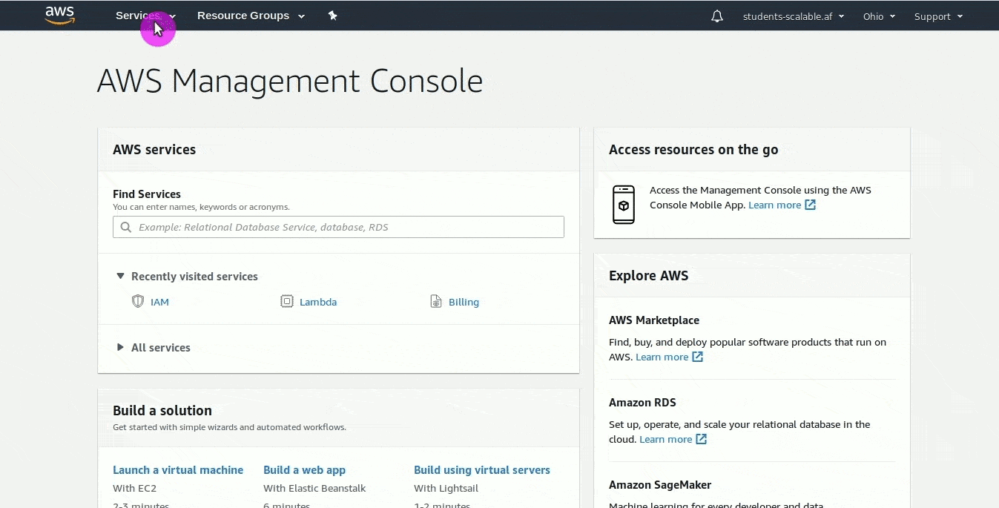

# Lab 1.2 - Creating a Lambda function from the CLI

- Create the same function from Lab #1 using only the AWS CLI.
- Run/Invoke the function from the CLI using a custom payload.

The AWS Management Console is incredibly useful and we will continue to use it throughout this course but most of the time you will likely want to work from the CLI. In this lab we will be creating a new Lambda function from some boiler plate code, and then updating it from the command line.

*Be sure you have the AWS CLI setup as mentioned in the general info for this course - we will use it extensively for the rest of these labs*

***We will be creating a new role that can be assumed via the CLI. The role that was created automatically in lab1 will only work for services***

## Steps

1. Find the IAM service, click on `roles` and create a new role (The instructions get less verbose as you learn your way around AWS).
2. Select `Lambda` from the `Trusted entity` page.
3. Apply the `AWSLambdaBasicExecutionRole`
4. Name your role something that is easy to identify such as `student00-lambda-cli-role` using your proper student ID.  
    
5. Create your git repo
6. Create a single file in your repo `main.py`
7. Paste in the following code (it may look familiar, it is the same code that is in the hello-world-python template)
    ```python
    import json

    print('Loading function')


    def lambda_handler(event, context):
        #print("Received event: " + json.dumps(event, indent=2))
        print("value1 = " + event['key1'])
        print("value2 = " + event['key2'])
        print("value3 = " + event['key3'])
        return event['key1']  # Echo back the first key value
        #raise Exception('Something went wrong')
    ```
8. To upload a lambda function we have to zip up the code `zip  function.zip main.py`
    >    *Lambda takes your zipped up code and injects it into a container and registers the event handler like we talked about in the training leading up to this lab. We are effectively giving it a code blob to run in the Lambda container*
9.  Upload the function using the AWS CLI (replace everything inside of the { } with your own values)
    ```sh
    aws lambda create-function --function-name {FUNCTION_NAME - ex. student00-lab2} \
    --zip-file fileb://function.zip --handler main.lambda_handler --runtime python3.7 \
    --role arn:aws:iam::{AWS_ACCOUNT_ID}:role/{EXECUTION_ROLE_FROM_ABOVE}
    ```
    You should get a json formatted output similar to the below
    ```json
    {
        "TracingConfig": {
            "Mode": "PassThrough"
        }, 
        "CodeSha256": "ugE+3+kfQiZZumQHFJxyy7yTxErtzAX8kiT4tgfLQ7M=", 
        "FunctionName": "student00-lab2", 
        "CodeSize": 378, 
        "RevisionId": "e2822df2-2450-42d4-90a8-c6e7bf0b79e0", 
        "MemorySize": 128, 
        "FunctionArn": "arn:aws:lambda:us-east-2:1234567890:function:student00-lab2", 
        "Version": "$LATEST", 
        "Role": "arn:aws:iam::1234567890:role/student00-lambda-cli-role", 
        "Timeout": 3, 
        "LastModified": "2019-05-12T12:22:51.690+0000", 
        "Handler": "main.lambda_handler", 
        "Runtime": "python3.7", 
        "Description": ""
    }

    ```
10. Instead of creating a test event, we can invoke our function with a payload direction and view a small snippet of the log.
    ```sh
    aws lambda invoke --function-name {FUNCTION_NAME eg. student00-lab2} --log-type Tail \
    --payload '{"key1":"value1", "key2":"value2", "key3":"value3"}' \
    outputfile.txt
    ```
    Once the function completes we can decode the base64 encoded response
    ```json
    {
        "LogResult": "U1RBUlQgUmVxdWVzdElkOiA5Nzc1MWRlNi1mNDViLTQ5OTgtOGJhNC05MzVkMTMwMmM3MmIgVmVyc2lvbjogJExBVEVTVAp2YWx1ZTEgPSB2YWx1ZTEKdmFsdWUyID0gdmFsdWUyCnZhbHVlMyA9IHZhbHVlMwpFTkQgUmVxdWVzdElkOiA5Nzc1MWRlNi1mNDViLTQ5OTgtOGJhNC05MzVkMTMwMmM3MmIKUkVQT1JUIFJlcXVlc3RJZDogOTc3NTFkZTYtZjQ1Yi00OTk4LThiYTQtOTM1ZDEzMDJjNzJiCUR1cmF0aW9uOiAyLjc0IG1zCUJpbGxlZCBEdXJhdGlvbjogMTAwIG1zIAlNZW1vcnkgU2l6ZTogMTI4IE1CCU1heCBNZW1vcnkgVXNlZDogNTMgTUIJCg==", 
        "ExecutedVersion": "$LATEST", 
        "StatusCode": 200
    }
    ```
    Copy the LogResult above into an echo command and decode it ( this could be done inline with jq if one wanted )
    ```sh
    echo U1RBUlQgUmVxdWVzdElkOiA5Nzc1MWRlNi1mNDViLTQ5OTgtOGJhNC05MzVkMTMwMmM3MmIgVmVyc2lvbjogJExBVEVTVAp2YWx1ZTEgPSB2YWx1ZTEKdmFsdWUyID0gdmFsdWUyCnZhbHVlMyA9IHZhbHVlMwpFTkQgUmVxdWVzdElkOiA5Nzc1MWRlNi1mNDViLTQ5OTgtOGJhNC05MzVkMTMwMmM3MmIKUkVQT1JUIFJlcXVlc3RJZDogOTc3NTFkZTYtZjQ1Yi00OTk4LThiYTQtOTM1ZDEzMDJjNzJiCUR1cmF0aW9uOiAyLjc0IG1zCUJpbGxlZCBEdXJhdGlvbjogMTAwIG1zIAlNZW1vcnkgU2l6ZTogMTI4IE1CCU1heCBNZW1vcnkgVXNlZDogNTMgTUIJCg== | base64 --decode
    ```
    Which should provide output similar to what we saw when running the test manually
    ```sh
    START RequestId: 97751de6-f45b-4998-8ba4-935d1302c72b Version: $LATEST
    value1 = value1
    value2 = value2
    value3 = value3
    END RequestId: 97751de6-f45b-4998-8ba4-935d1302c72b
    REPORT RequestId: 97751de6-f45b-4998-8ba4-935d1302c72b	Duration: 2.74 ms	Billed Duration: 100 ms 	Memory Size: 128 MB	Max Memory Used: 53 MB	

    ```

# Updating a Lambda function from the CLI
Now that we have created a Lambda function updating it from the command line is a matter of zipping up the new file and running the `update-function-code` command.

1. Modify the file however you would like, save it and zip it up again 
   ```
   zip function.zip main.py
   ```
2. Update the function with your new zip file
    ```sh
    aws lambda update-function-code --function-name {FUNCTION_NAME eg. student00-lab2} \
    --zip-file fileb://function.zip
    ```
    ```json
    {
    "TracingConfig": {
        "Mode": "PassThrough"
    }, 
    "CodeSha256": "8sv0O+OkGPSUTrwqcko+xAg0Z6rTTZmxH/eWUI9JziE=", 
    "FunctionName": "student00-lab2", 
    "CodeSize": 373, 
    "RevisionId": "9492c65c-732d-4708-b201-021deac1f5a7", 
    "MemorySize": 128, 
    "FunctionArn": "arn:aws:lambda:us-east-2:1234567890:function:student00-lab2", 
    "Version": "$LATEST", 
    "Role": "arn:aws:iam::1234567890:role/lambda-cli-role", 
    "Timeout": 3, 
    "LastModified": "2019-05-12T12:26:42.346+0000", 
    "Handler": "main.lambda_handler", 
    "Runtime": "python3.7", 
    "Description": ""
    }
    ```